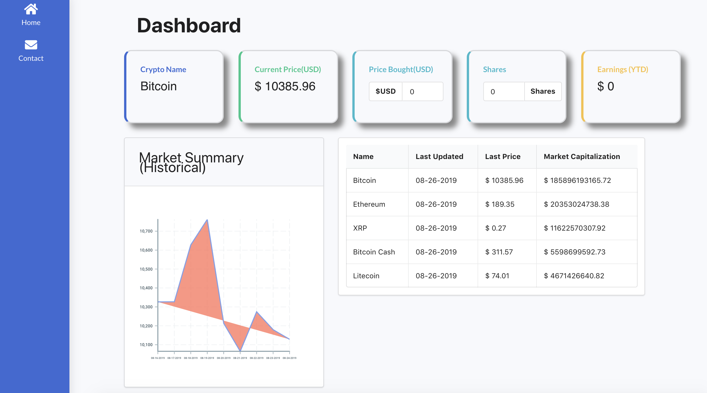

[](https://travis-ci.com/ThomasN72/webscraper)


<video tabindex="-1" class="video-stream html5-main-video" webkit-playsinline="" playsinline="" controlslist="nodownload" style="width: 1310px; height: 737px; left: 17px; top: 0px;" src="blob:https://www.youtube.com/47e0e8a9-b4fa-4ced-9a49-d8ed1b3edc64"></video>
<div>hello world</div>
<strong>hello world</strong>
<iframe width="560" 
        height="315" 
        src="https://www.youtube.com/watch?v=hcLVxll-Rhw" 
        title="YouTube video player" 
        frameborder="0" 
        allow="accelerometer; autoplay; clipboard-write; encrypted-media; gyroscope; picture-in-picture" 
        allowfullscreen>
</iframe>
 
# Crypto_Application
Welcome to the crypto tracker. This tracker retrieves real time cryto prices and simulates profit/loss on crypto tradings.
Simply click on each crypto on the table to receive real-time pricing and observe the trend of each cryptocurrency for the past 7 days.

<iframe width="560" 
        height="315" 
        src="https://www.youtube.com/watch?v=hcLVxll-Rhw" 
        title="YouTube video player" 
        frameborder="0" 
        allow="accelerometer; autoplay; clipboard-write; encrypted-media; gyroscope; picture-in-picture" 
        allowfullscreen>
</iframe>


<video tabindex="-1" class="video-stream html5-main-video" webkit-playsinline="" playsinline="" controlslist="nodownload" style="width: 1310px; height: 737px; left: 17px; top: 0px;" src="blob:https://www.youtube.com/47e0e8a9-b4fa-4ced-9a49-d8ed1b3edc64"></video>

You can also enter *the number of shares* and *purchase price* to simulate potential profit/loss.


Sample Url: https://nameless-beach-75795.herokuapp.com/




## Installation
Run the below command to use [node] to install packages.
The command should install both client and server side dependencies.
(Please refer to package.json for package dependencies)
```node
npm install
```

## Setup
This crypto tracker uses 2 different APIs.
1. https://coinmarketcap.com/
2. https://coincap.io 

MarketCap requires an API key which you can register and use the free version. Coincap is completely free and no api key is needed.

Create a .env file in the root folder and update the below information.

Substitute the below with your own API key and password. If you would like to use the contact form as well, go ahead and update all the email information, otherwise, skip the email section.

```
EMAIL_HOST=smtp.gmail.com
EMAIL_USER=SENDEREMAIL
EMAIL_PASS=SENDERPASSWORD
EMAIL_RECEIPENT=RECEIPENTEMAIL

CRYPTO_API=API KEY
```

## Usage
Use npm start to begin running locally and start debugging.
```node
npm run start:prod
```

## Enjoy and have fun!

